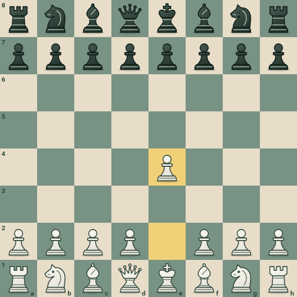

# Chess implementation

Chess now has three disposable match modes: local two-player, Stockfish 19 AI,
and LAN multiplayer. The main menu opens `ChessHomePage`. No chess session,
move log, or engine state is written to preferences, disk, or a database.

## Rules and state

`lib/chess/` owns immutable positions, FEN/UCI codecs, legal move generation,
castling, en passant, all four promotions, check/checkmate/stalemate, repetition,
50/75-move rules, known dead-material cases, resignation and draw agreement.
`ChessSession` is the sole rules authority used by UI, engine and LAN.
Threefold and 50-move claims support both the current position and a declared
legal next move. Fivefold and 75-move draws are automatic; checkmate takes priority.
Dead-position detection is deliberately conservative: it recognizes bare kings,
a lone bishop/knight and bishops all on the same colour complex. It does not
incorrectly draw bishop+knight or two knights; arbitrary blocked positions are
not solved by exhaustive reachability search.

Undo restores the complete position and repetition counts. AI undo returns to
the player's turn. Generation checks reject stale AI moves on undo, restart,
resignation, lifecycle suspension and page disposal. Search cancellation drains
UCI `bestmove` before another search. The old GameSession Chess prototype is
removed, and its obsolete tests are replaced by independent rules/widget tests.

## Stockfish distribution

- Android: official `sf_19`, commit `edb0d9db6731067ec50ce619ff372b463bc4dd5d`.
  The official ARM64 universal executable is extracted to `libstockfish.so` and
  packaged in nativeLibraryDir. MethodChannel commands and EventChannel output
  use background IO threads; quitting destroys the child process.
- Web: Stockfish.js `v19.0.0`, commit `9cb3e5066d48f1a35d792afeda36eff37ae60570`.
  The lite, single-threaded WASM build runs inside a dedicated Worker and needs
  neither SharedArrayBuffer nor cross-origin isolation. It uses a smaller NNUE
  network than Android, so equal difficulty levels are not identical strength.
- Both default to one thread, 16 MiB hash, and bounded thinking time. Six levels
  map centrally to Skill Level and movetime, with no technical tuning in the UI.
- `tools/prepare_stockfish.py` pins and checks SHA-256 for every engine artifact.
  Large binaries are fetched at build time instead of checked into Git.
  Source, licenses and build instructions are linked in the app's About page.

## LAN

The existing `LanHostServer` / `LanClientConnection` transports handle all games.
Chess handshakes include `game: chess` and `rulesVersion: 1`; moves use UCI strings.
The host assigns White first, validates authenticated requests and commits seq
only after success. Replicas apply committed events; clients never move early.
Negotiated undo/draw, unilateral resignation and valid draw claims all replay.
Undo may only request the sender's most recent move before the opponent replies.
After a result, either player may invite a rematch; only the opponent can accept.
Acceptance clears the game state while retaining the room, seats and monotonic
sequence numbers. Requests time out after 30 seconds. The round transition is
replayed on reconnect, including when a client missed the acceptance.
Protocol version 3 requires both peers to update together. Checkers assigns the
host the variant's first-moving side. Both Chess and Checkers keep the local
player's pieces at the bottom, with input mapped to canonical board coordinates.
A reconnect completes only after a full authoritative event-log replay, restoring
FEN, result, repetition and negotiations. The room log is discarded when closed.

## Board rendering

Chess pieces are repo-owned vector silhouettes, shared with the promotion picker.
The board painter captures an immutable position and redraws backgrounds, pieces
and markers together. Moving, capturing, undoing and flipping are checked against
a newly mounted board's pixels to guard against stale pieces at vacated squares.



## Build and verify

```sh
python3 tools/prepare_stockfish.py             # Android + Web, checksum-pinned
flutter pub get
dart analyze lib test
flutter test
flutter build web --no-wasm-dry-run
python3 tools/package_lan_android.py --debug

# Browser Worker smoke at a nested Pages-like URL, without isolation headers:
npm install --no-save --package-lock=false playwright@1.58.2
npx playwright install --with-deps chromium
node tools/test_stockfish_web.cjs

# Optional real native protocol test (also run under QEMU ARM64 in CI):
STOCKFISH_TEST_EXECUTABLE=/path/to/stockfish flutter test test/chess/chess_engine_test.dart
```

For a Web-only checkout, `python3 tools/prepare_stockfish.py --web-only` is enough.
The Android packaging helper prepares the engines automatically. GitHub Pages,
Flutter checks, and signed release workflows all prepare the pinned assets.
The release workflow now also handles a version change on main: after analysis,
tests and signed APK build succeed, it creates the matching tag and release.
Existing published versions are skipped; existing tags are never moved.

## Validation

- Local: 286 tests passed, including 31 Chess tests and the real ARM64 binary
  running under QEMU. Existing Go/KataGo/Draughts tests pass unchanged in behavior.
- Perft: initial depths 1–4 = 20, 400, 8902, 197281; Kiwipete depths 1–3 =
  48, 2039, 97862; three additional classic endgame/promotion/check suites pass.
- Dart analysis and release Web compilation pass locally.
- Real WebSocket tests verify seat assignment, ordinary and special moves,
  negotiation, stale/invalid seq rejection, replay and disconnect/reconnect.
- The v1.3.0 CI passed the real browser Worker smoke and Android packaging,
  and published the signed APK. Physical Android device interaction is not
  simulated by the QEMU UCI test.
